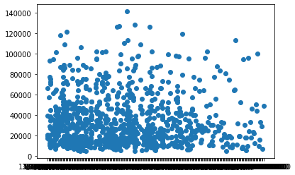
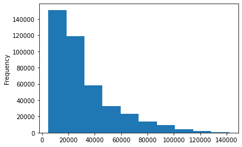
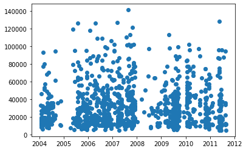
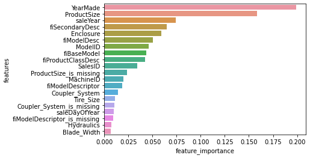

# Predicting the sale price of Bulldozers using Machine Learning

In this notebook, we're going to go through an example Machine Learning project with the goal of predicting the sale price of the bulldozers.

## 1. Problem Definition

>How well can we predict the future sale price of a bulldozer, given its characteristics and with previous examples of how much a similar bulldozer was sold for? 

## 2. Data

The data is downloaded from Kaggle Bluebook for Bulldozer competition.

There are three main datasets:

* Train.csv is the training set, which contains data through the end of 2011.
* Valid.csv is the validation set, which contains data from January 1, 2012 - April 30, 2012 You make predictions on this set throughout the majority of the competition. Your score on this set is used to create the public leaderboard.
* Test.csv is the test set, which won't be released until the last week of the competition. It contains data from May 1, 2012 - November 2012. Your score on the test set determines your final rank for the competition.

## 3. Evaluation

The evaluation metric for this competition is the RMSLE (root mean squared log error) between the actual and predicted auction prices.

**Note:** Goal is to minimize the RMSLE error

## 4. Features

Kaggle provides a data dictionary detailing all of the features of the dataset. To view the dictionary on google sheets:
https://docs.google.com/spreadsheets/d/11NH89B76wsSVqQ2OK7cgOKks4q_PLNSPJxMUKNJoaOA/edit?usp=sharing


```python
import numpy as np
import pandas as pd
import matplotlib.pyplot as plt
import seaborn as sns
import sklearn
```


```python
df = pd.read_csv('data/TrainAndValid.csv',
                low_memory=False)
```


```python
df.info()
```

    <class 'pandas.core.frame.DataFrame'>
    RangeIndex: 412698 entries, 0 to 412697
    Data columns (total 53 columns):
     #   Column                    Non-Null Count   Dtype  
    ---  ------                    --------------   -----  
     0   SalesID                   412698 non-null  int64  
     1   SalePrice                 412698 non-null  float64
     2   MachineID                 412698 non-null  int64  
     3   ModelID                   412698 non-null  int64  
     4   datasource                412698 non-null  int64  
     5   auctioneerID              392562 non-null  float64
     6   YearMade                  412698 non-null  int64  
     7   MachineHoursCurrentMeter  147504 non-null  float64
     8   UsageBand                 73670 non-null   object 
     9   saledate                  412698 non-null  object 
     10  fiModelDesc               412698 non-null  object 
     11  fiBaseModel               412698 non-null  object 
     12  fiSecondaryDesc           271971 non-null  object 
     13  fiModelSeries             58667 non-null   object 
     14  fiModelDescriptor         74816 non-null   object 
     15  ProductSize               196093 non-null  object 
     16  fiProductClassDesc        412698 non-null  object 
     17  state                     412698 non-null  object 
     18  ProductGroup              412698 non-null  object 
     19  ProductGroupDesc          412698 non-null  object 
     20  Drive_System              107087 non-null  object 
     21  Enclosure                 412364 non-null  object 
     22  Forks                     197715 non-null  object 
     23  Pad_Type                  81096 non-null   object 
     24  Ride_Control              152728 non-null  object 
     25  Stick                     81096 non-null   object 
     26  Transmission              188007 non-null  object 
     27  Turbocharged              81096 non-null   object 
     28  Blade_Extension           25983 non-null   object 
     29  Blade_Width               25983 non-null   object 
     30  Enclosure_Type            25983 non-null   object 
     31  Engine_Horsepower         25983 non-null   object 
     32  Hydraulics                330133 non-null  object 
     33  Pushblock                 25983 non-null   object 
     34  Ripper                    106945 non-null  object 
     35  Scarifier                 25994 non-null   object 
     36  Tip_Control               25983 non-null   object 
     37  Tire_Size                 97638 non-null   object 
     38  Coupler                   220679 non-null  object 
     39  Coupler_System            44974 non-null   object 
     40  Grouser_Tracks            44875 non-null   object 
     41  Hydraulics_Flow           44875 non-null   object 
     42  Track_Type                102193 non-null  object 
     43  Undercarriage_Pad_Width   102916 non-null  object 
     44  Stick_Length              102261 non-null  object 
     45  Thumb                     102332 non-null  object 
     46  Pattern_Changer           102261 non-null  object 
     47  Grouser_Type              102193 non-null  object 
     48  Backhoe_Mounting          80712 non-null   object 
     49  Blade_Type                81875 non-null   object 
     50  Travel_Controls           81877 non-null   object 
     51  Differential_Type         71564 non-null   object 
     52  Steering_Controls         71522 non-null   object 
    dtypes: float64(3), int64(5), object(45)
    memory usage: 166.9+ MB


```python
df.isna().sum()
```


    SalesID                          0
    SalePrice                        0
    MachineID                        0
    ModelID                          0
    datasource                       0
    auctioneerID                 20136
    YearMade                         0
    MachineHoursCurrentMeter    265194
    UsageBand                   339028
    saledate                         0
    fiModelDesc                      0
    fiBaseModel                      0
    fiSecondaryDesc             140727
    fiModelSeries               354031
    fiModelDescriptor           337882
    ProductSize                 216605
    fiProductClassDesc               0
    state                            0
    ProductGroup                     0
    ProductGroupDesc                 0
    Drive_System                305611
    Enclosure                      334
    Forks                       214983
    Pad_Type                    331602
    Ride_Control                259970
    Stick                       331602
    Transmission                224691
    Turbocharged                331602
    Blade_Extension             386715
    Blade_Width                 386715
    Enclosure_Type              386715
    Engine_Horsepower           386715
    Hydraulics                   82565
    Pushblock                   386715
    Ripper                      305753
    Scarifier                   386704
    Tip_Control                 386715
    Tire_Size                   315060
    Coupler                     192019
    Coupler_System              367724
    Grouser_Tracks              367823
    Hydraulics_Flow             367823
    Track_Type                  310505
    Undercarriage_Pad_Width     309782
    Stick_Length                310437
    Thumb                       310366
    Pattern_Changer             310437
    Grouser_Type                310505
    Backhoe_Mounting            331986
    Blade_Type                  330823
    Travel_Controls             330821
    Differential_Type           341134
    Steering_Controls           341176
    dtype: int64


```python
fig, ax = plt.subplots()
ax.scatter(df['saledate'][:1000], df['SalePrice'][:1000])
```


    <matplotlib.collections.PathCollection at 0x1441c9f10>


    

    


```python
df.SalePrice.plot.hist()
```


    <AxesSubplot:ylabel='Frequency'>


    

    


### Parsing Dates


```python
df = pd.read_csv('data/TrainAndValid.csv',
                low_memory=False,
                parse_dates=['saledate'])
```


```python
fig, ax = plt.subplots()
ax.scatter(df['saledate'][:1000], df['SalePrice'][:1000])
```


    <matplotlib.collections.PathCollection at 0x144062640>


    

    


```python
df.head().T
```


<div>
<style scoped>
    .dataframe tbody tr th:only-of-type {
        vertical-align: middle;
    }

    .dataframe tbody tr th {
        vertical-align: top;
    }

    .dataframe thead th {
        text-align: right;
    }
</style>
<table border="1" class="dataframe">
  <thead>
    <tr style="text-align: right;">
      <th></th>
      <th>0</th>
      <th>1</th>
      <th>2</th>
      <th>3</th>
      <th>4</th>
    </tr>
  </thead>
  <tbody>
    <tr>
      <th>SalesID</th>
      <td>1139246</td>
      <td>1139248</td>
      <td>1139249</td>
      <td>1139251</td>
      <td>1139253</td>
    </tr>
    <tr>
      <th>SalePrice</th>
      <td>66000.0</td>
      <td>57000.0</td>
      <td>10000.0</td>
      <td>38500.0</td>
      <td>11000.0</td>
    </tr>
    <tr>
      <th>MachineID</th>
      <td>999089</td>
      <td>117657</td>
      <td>434808</td>
      <td>1026470</td>
      <td>1057373</td>
    </tr>
    <tr>
      <th>ModelID</th>
      <td>3157</td>
      <td>77</td>
      <td>7009</td>
      <td>332</td>
      <td>17311</td>
    </tr>
    <tr>
      <th>datasource</th>
      <td>121</td>
      <td>121</td>
      <td>121</td>
      <td>121</td>
      <td>121</td>
    </tr>
    <tr>
      <th>auctioneerID</th>
      <td>3.0</td>
      <td>3.0</td>
      <td>3.0</td>
      <td>3.0</td>
      <td>3.0</td>
    </tr>
    <tr>
      <th>YearMade</th>
      <td>2004</td>
      <td>1996</td>
      <td>2001</td>
      <td>2001</td>
      <td>2007</td>
    </tr>
    <tr>
      <th>MachineHoursCurrentMeter</th>
      <td>68.0</td>
      <td>4640.0</td>
      <td>2838.0</td>
      <td>3486.0</td>
      <td>722.0</td>
    </tr>
    <tr>
      <th>UsageBand</th>
      <td>Low</td>
      <td>Low</td>
      <td>High</td>
      <td>High</td>
      <td>Medium</td>
    </tr>
    <tr>
      <th>saledate</th>
      <td>2006-11-16 00:00:00</td>
      <td>2004-03-26 00:00:00</td>
      <td>2004-02-26 00:00:00</td>
      <td>2011-05-19 00:00:00</td>
      <td>2009-07-23 00:00:00</td>
    </tr>
    <tr>
      <th>fiModelDesc</th>
      <td>521D</td>
      <td>950FII</td>
      <td>226</td>
      <td>PC120-6E</td>
      <td>S175</td>
    </tr>
    <tr>
      <th>fiBaseModel</th>
      <td>521</td>
      <td>950</td>
      <td>226</td>
      <td>PC120</td>
      <td>S175</td>
    </tr>
    <tr>
      <th>fiSecondaryDesc</th>
      <td>D</td>
      <td>F</td>
      <td>NaN</td>
      <td>NaN</td>
      <td>NaN</td>
    </tr>
    <tr>
      <th>fiModelSeries</th>
      <td>NaN</td>
      <td>II</td>
      <td>NaN</td>
      <td>-6E</td>
      <td>NaN</td>
    </tr>
    <tr>
      <th>fiModelDescriptor</th>
      <td>NaN</td>
      <td>NaN</td>
      <td>NaN</td>
      <td>NaN</td>
      <td>NaN</td>
    </tr>
    <tr>
      <th>ProductSize</th>
      <td>NaN</td>
      <td>Medium</td>
      <td>NaN</td>
      <td>Small</td>
      <td>NaN</td>
    </tr>
    <tr>
      <th>fiProductClassDesc</th>
      <td>Wheel Loader - 110.0 to 120.0 Horsepower</td>
      <td>Wheel Loader - 150.0 to 175.0 Horsepower</td>
      <td>Skid Steer Loader - 1351.0 to 1601.0 Lb Operat...</td>
      <td>Hydraulic Excavator, Track - 12.0 to 14.0 Metr...</td>
      <td>Skid Steer Loader - 1601.0 to 1751.0 Lb Operat...</td>
    </tr>
    <tr>
      <th>state</th>
      <td>Alabama</td>
      <td>North Carolina</td>
      <td>New York</td>
      <td>Texas</td>
      <td>New York</td>
    </tr>
    <tr>
      <th>ProductGroup</th>
      <td>WL</td>
      <td>WL</td>
      <td>SSL</td>
      <td>TEX</td>
      <td>SSL</td>
    </tr>
    <tr>
      <th>ProductGroupDesc</th>
      <td>Wheel Loader</td>
      <td>Wheel Loader</td>
      <td>Skid Steer Loaders</td>
      <td>Track Excavators</td>
      <td>Skid Steer Loaders</td>
    </tr>
    <tr>
      <th>Drive_System</th>
      <td>NaN</td>
      <td>NaN</td>
      <td>NaN</td>
      <td>NaN</td>
      <td>NaN</td>
    </tr>
    <tr>
      <th>Enclosure</th>
      <td>EROPS w AC</td>
      <td>EROPS w AC</td>
      <td>OROPS</td>
      <td>EROPS w AC</td>
      <td>EROPS</td>
    </tr>
    <tr>
      <th>Forks</th>
      <td>None or Unspecified</td>
      <td>None or Unspecified</td>
      <td>None or Unspecified</td>
      <td>NaN</td>
      <td>None or Unspecified</td>
    </tr>
    <tr>
      <th>Pad_Type</th>
      <td>NaN</td>
      <td>NaN</td>
      <td>NaN</td>
      <td>NaN</td>
      <td>NaN</td>
    </tr>
    <tr>
      <th>Ride_Control</th>
      <td>None or Unspecified</td>
      <td>None or Unspecified</td>
      <td>NaN</td>
      <td>NaN</td>
      <td>NaN</td>
    </tr>
    <tr>
      <th>Stick</th>
      <td>NaN</td>
      <td>NaN</td>
      <td>NaN</td>
      <td>NaN</td>
      <td>NaN</td>
    </tr>
    <tr>
      <th>Transmission</th>
      <td>NaN</td>
      <td>NaN</td>
      <td>NaN</td>
      <td>NaN</td>
      <td>NaN</td>
    </tr>
    <tr>
      <th>Turbocharged</th>
      <td>NaN</td>
      <td>NaN</td>
      <td>NaN</td>
      <td>NaN</td>
      <td>NaN</td>
    </tr>
    <tr>
      <th>Blade_Extension</th>
      <td>NaN</td>
      <td>NaN</td>
      <td>NaN</td>
      <td>NaN</td>
      <td>NaN</td>
    </tr>
    <tr>
      <th>Blade_Width</th>
      <td>NaN</td>
      <td>NaN</td>
      <td>NaN</td>
      <td>NaN</td>
      <td>NaN</td>
    </tr>
    <tr>
      <th>Enclosure_Type</th>
      <td>NaN</td>
      <td>NaN</td>
      <td>NaN</td>
      <td>NaN</td>
      <td>NaN</td>
    </tr>
    <tr>
      <th>Engine_Horsepower</th>
      <td>NaN</td>
      <td>NaN</td>
      <td>NaN</td>
      <td>NaN</td>
      <td>NaN</td>
    </tr>
    <tr>
      <th>Hydraulics</th>
      <td>2 Valve</td>
      <td>2 Valve</td>
      <td>Auxiliary</td>
      <td>2 Valve</td>
      <td>Auxiliary</td>
    </tr>
    <tr>
      <th>Pushblock</th>
      <td>NaN</td>
      <td>NaN</td>
      <td>NaN</td>
      <td>NaN</td>
      <td>NaN</td>
    </tr>
    <tr>
      <th>Ripper</th>
      <td>NaN</td>
      <td>NaN</td>
      <td>NaN</td>
      <td>NaN</td>
      <td>NaN</td>
    </tr>
    <tr>
      <th>Scarifier</th>
      <td>NaN</td>
      <td>NaN</td>
      <td>NaN</td>
      <td>NaN</td>
      <td>NaN</td>
    </tr>
    <tr>
      <th>Tip_Control</th>
      <td>NaN</td>
      <td>NaN</td>
      <td>NaN</td>
      <td>NaN</td>
      <td>NaN</td>
    </tr>
    <tr>
      <th>Tire_Size</th>
      <td>None or Unspecified</td>
      <td>23.5</td>
      <td>NaN</td>
      <td>NaN</td>
      <td>NaN</td>
    </tr>
    <tr>
      <th>Coupler</th>
      <td>None or Unspecified</td>
      <td>None or Unspecified</td>
      <td>None or Unspecified</td>
      <td>None or Unspecified</td>
      <td>None or Unspecified</td>
    </tr>
    <tr>
      <th>Coupler_System</th>
      <td>NaN</td>
      <td>NaN</td>
      <td>None or Unspecified</td>
      <td>NaN</td>
      <td>None or Unspecified</td>
    </tr>
    <tr>
      <th>Grouser_Tracks</th>
      <td>NaN</td>
      <td>NaN</td>
      <td>None or Unspecified</td>
      <td>NaN</td>
      <td>None or Unspecified</td>
    </tr>
    <tr>
      <th>Hydraulics_Flow</th>
      <td>NaN</td>
      <td>NaN</td>
      <td>Standard</td>
      <td>NaN</td>
      <td>Standard</td>
    </tr>
    <tr>
      <th>Track_Type</th>
      <td>NaN</td>
      <td>NaN</td>
      <td>NaN</td>
      <td>NaN</td>
      <td>NaN</td>
    </tr>
    <tr>
      <th>Undercarriage_Pad_Width</th>
      <td>NaN</td>
      <td>NaN</td>
      <td>NaN</td>
      <td>NaN</td>
      <td>NaN</td>
    </tr>
    <tr>
      <th>Stick_Length</th>
      <td>NaN</td>
      <td>NaN</td>
      <td>NaN</td>
      <td>NaN</td>
      <td>NaN</td>
    </tr>
    <tr>
      <th>Thumb</th>
      <td>NaN</td>
      <td>NaN</td>
      <td>NaN</td>
      <td>NaN</td>
      <td>NaN</td>
    </tr>
    <tr>
      <th>Pattern_Changer</th>
      <td>NaN</td>
      <td>NaN</td>
      <td>NaN</td>
      <td>NaN</td>
      <td>NaN</td>
    </tr>
    <tr>
      <th>Grouser_Type</th>
      <td>NaN</td>
      <td>NaN</td>
      <td>NaN</td>
      <td>NaN</td>
      <td>NaN</td>
    </tr>
    <tr>
      <th>Backhoe_Mounting</th>
      <td>NaN</td>
      <td>NaN</td>
      <td>NaN</td>
      <td>NaN</td>
      <td>NaN</td>
    </tr>
    <tr>
      <th>Blade_Type</th>
      <td>NaN</td>
      <td>NaN</td>
      <td>NaN</td>
      <td>NaN</td>
      <td>NaN</td>
    </tr>
    <tr>
      <th>Travel_Controls</th>
      <td>NaN</td>
      <td>NaN</td>
      <td>NaN</td>
      <td>NaN</td>
      <td>NaN</td>
    </tr>
    <tr>
      <th>Differential_Type</th>
      <td>Standard</td>
      <td>Standard</td>
      <td>NaN</td>
      <td>NaN</td>
      <td>NaN</td>
    </tr>
    <tr>
      <th>Steering_Controls</th>
      <td>Conventional</td>
      <td>Conventional</td>
      <td>NaN</td>
      <td>NaN</td>
      <td>NaN</td>
    </tr>
  </tbody>
</table>
</div>


```python
df.saledate.head(20)
```


    0    2006-11-16
    1    2004-03-26
    2    2004-02-26
    3    2011-05-19
    4    2009-07-23
    5    2008-12-18
    6    2004-08-26
    7    2005-11-17
    8    2009-08-27
    9    2007-08-09
    10   2008-08-21
    11   2006-08-24
    12   2005-10-20
    13   2006-01-26
    14   2006-01-03
    15   2006-11-16
    16   2007-06-14
    17   2010-01-28
    18   2006-03-09
    19   2005-11-17
    Name: saledate, dtype: datetime64[ns]


```python
#Sorting Dataframe in Date order
df.sort_values(by=['saledate'], ascending=True, inplace=True)
df.saledate.head(20)
```


    205615   1989-01-17
    274835   1989-01-31
    141296   1989-01-31
    212552   1989-01-31
    62755    1989-01-31
    54653    1989-01-31
    81383    1989-01-31
    204924   1989-01-31
    135376   1989-01-31
    113390   1989-01-31
    113394   1989-01-31
    116419   1989-01-31
    32138    1989-01-31
    127610   1989-01-31
    76171    1989-01-31
    127000   1989-01-31
    128130   1989-01-31
    127626   1989-01-31
    55455    1989-01-31
    55454    1989-01-31
    Name: saledate, dtype: datetime64[ns]


```python
#Make a copy of df
df_temp = df.copy()
```


```python
#Extracting date into 'Year', 'Month', 'Day', 'Day of week', 'Day of Year'
df_temp['saleYear'] = df_temp.saledate.dt.year
df_temp['saleMonth'] = df_temp.saledate.dt.month
df_temp['saleDay'] = df_temp.saledate.dt.day
df_temp['saleDayOfWeek'] = df_temp.saledate.dt.dayofweek
df_temp['saleDayOfYear'] = df_temp.saledate.dt.dayofyear

#Removing ['saledate'] from df_temp
df_temp.drop(['saledate'], axis=1, inplace=True)

#Seeing the new DataFrame
df_temp.head().T
```


<div>
<style scoped>
    .dataframe tbody tr th:only-of-type {
        vertical-align: middle;
    }

    .dataframe tbody tr th {
        vertical-align: top;
    }

    .dataframe thead th {
        text-align: right;
    }
</style>
<table border="1" class="dataframe">
  <thead>
    <tr style="text-align: right;">
      <th></th>
      <th>205615</th>
      <th>274835</th>
      <th>141296</th>
      <th>212552</th>
      <th>62755</th>
    </tr>
  </thead>
  <tbody>
    <tr>
      <th>SalesID</th>
      <td>1646770</td>
      <td>1821514</td>
      <td>1505138</td>
      <td>1671174</td>
      <td>1329056</td>
    </tr>
    <tr>
      <th>SalePrice</th>
      <td>9500.0</td>
      <td>14000.0</td>
      <td>50000.0</td>
      <td>16000.0</td>
      <td>22000.0</td>
    </tr>
    <tr>
      <th>MachineID</th>
      <td>1126363</td>
      <td>1194089</td>
      <td>1473654</td>
      <td>1327630</td>
      <td>1336053</td>
    </tr>
    <tr>
      <th>ModelID</th>
      <td>8434</td>
      <td>10150</td>
      <td>4139</td>
      <td>8591</td>
      <td>4089</td>
    </tr>
    <tr>
      <th>datasource</th>
      <td>132</td>
      <td>132</td>
      <td>132</td>
      <td>132</td>
      <td>132</td>
    </tr>
    <tr>
      <th>auctioneerID</th>
      <td>18.0</td>
      <td>99.0</td>
      <td>99.0</td>
      <td>99.0</td>
      <td>99.0</td>
    </tr>
    <tr>
      <th>YearMade</th>
      <td>1974</td>
      <td>1980</td>
      <td>1978</td>
      <td>1980</td>
      <td>1984</td>
    </tr>
    <tr>
      <th>MachineHoursCurrentMeter</th>
      <td>NaN</td>
      <td>NaN</td>
      <td>NaN</td>
      <td>NaN</td>
      <td>NaN</td>
    </tr>
    <tr>
      <th>UsageBand</th>
      <td>NaN</td>
      <td>NaN</td>
      <td>NaN</td>
      <td>NaN</td>
      <td>NaN</td>
    </tr>
    <tr>
      <th>fiModelDesc</th>
      <td>TD20</td>
      <td>A66</td>
      <td>D7G</td>
      <td>A62</td>
      <td>D3B</td>
    </tr>
    <tr>
      <th>fiBaseModel</th>
      <td>TD20</td>
      <td>A66</td>
      <td>D7</td>
      <td>A62</td>
      <td>D3</td>
    </tr>
    <tr>
      <th>fiSecondaryDesc</th>
      <td>NaN</td>
      <td>NaN</td>
      <td>G</td>
      <td>NaN</td>
      <td>B</td>
    </tr>
    <tr>
      <th>fiModelSeries</th>
      <td>NaN</td>
      <td>NaN</td>
      <td>NaN</td>
      <td>NaN</td>
      <td>NaN</td>
    </tr>
    <tr>
      <th>fiModelDescriptor</th>
      <td>NaN</td>
      <td>NaN</td>
      <td>NaN</td>
      <td>NaN</td>
      <td>NaN</td>
    </tr>
    <tr>
      <th>ProductSize</th>
      <td>Medium</td>
      <td>NaN</td>
      <td>Large</td>
      <td>NaN</td>
      <td>NaN</td>
    </tr>
    <tr>
      <th>fiProductClassDesc</th>
      <td>Track Type Tractor, Dozer - 105.0 to 130.0 Hor...</td>
      <td>Wheel Loader - 120.0 to 135.0 Horsepower</td>
      <td>Track Type Tractor, Dozer - 190.0 to 260.0 Hor...</td>
      <td>Wheel Loader - Unidentified</td>
      <td>Track Type Tractor, Dozer - 20.0 to 75.0 Horse...</td>
    </tr>
    <tr>
      <th>state</th>
      <td>Texas</td>
      <td>Florida</td>
      <td>Florida</td>
      <td>Florida</td>
      <td>Florida</td>
    </tr>
    <tr>
      <th>ProductGroup</th>
      <td>TTT</td>
      <td>WL</td>
      <td>TTT</td>
      <td>WL</td>
      <td>TTT</td>
    </tr>
    <tr>
      <th>ProductGroupDesc</th>
      <td>Track Type Tractors</td>
      <td>Wheel Loader</td>
      <td>Track Type Tractors</td>
      <td>Wheel Loader</td>
      <td>Track Type Tractors</td>
    </tr>
    <tr>
      <th>Drive_System</th>
      <td>NaN</td>
      <td>NaN</td>
      <td>NaN</td>
      <td>NaN</td>
      <td>NaN</td>
    </tr>
    <tr>
      <th>Enclosure</th>
      <td>OROPS</td>
      <td>OROPS</td>
      <td>OROPS</td>
      <td>EROPS</td>
      <td>OROPS</td>
    </tr>
    <tr>
      <th>Forks</th>
      <td>NaN</td>
      <td>None or Unspecified</td>
      <td>NaN</td>
      <td>None or Unspecified</td>
      <td>NaN</td>
    </tr>
    <tr>
      <th>Pad_Type</th>
      <td>NaN</td>
      <td>NaN</td>
      <td>NaN</td>
      <td>NaN</td>
      <td>NaN</td>
    </tr>
    <tr>
      <th>Ride_Control</th>
      <td>NaN</td>
      <td>None or Unspecified</td>
      <td>NaN</td>
      <td>None or Unspecified</td>
      <td>NaN</td>
    </tr>
    <tr>
      <th>Stick</th>
      <td>NaN</td>
      <td>NaN</td>
      <td>NaN</td>
      <td>NaN</td>
      <td>NaN</td>
    </tr>
    <tr>
      <th>Transmission</th>
      <td>Direct Drive</td>
      <td>NaN</td>
      <td>Standard</td>
      <td>NaN</td>
      <td>Standard</td>
    </tr>
    <tr>
      <th>Turbocharged</th>
      <td>NaN</td>
      <td>NaN</td>
      <td>NaN</td>
      <td>NaN</td>
      <td>NaN</td>
    </tr>
    <tr>
      <th>Blade_Extension</th>
      <td>NaN</td>
      <td>NaN</td>
      <td>NaN</td>
      <td>NaN</td>
      <td>NaN</td>
    </tr>
    <tr>
      <th>Blade_Width</th>
      <td>NaN</td>
      <td>NaN</td>
      <td>NaN</td>
      <td>NaN</td>
      <td>NaN</td>
    </tr>
    <tr>
      <th>Enclosure_Type</th>
      <td>NaN</td>
      <td>NaN</td>
      <td>NaN</td>
      <td>NaN</td>
      <td>NaN</td>
    </tr>
    <tr>
      <th>Engine_Horsepower</th>
      <td>NaN</td>
      <td>NaN</td>
      <td>NaN</td>
      <td>NaN</td>
      <td>NaN</td>
    </tr>
    <tr>
      <th>Hydraulics</th>
      <td>2 Valve</td>
      <td>2 Valve</td>
      <td>2 Valve</td>
      <td>2 Valve</td>
      <td>2 Valve</td>
    </tr>
    <tr>
      <th>Pushblock</th>
      <td>NaN</td>
      <td>NaN</td>
      <td>NaN</td>
      <td>NaN</td>
      <td>NaN</td>
    </tr>
    <tr>
      <th>Ripper</th>
      <td>None or Unspecified</td>
      <td>NaN</td>
      <td>None or Unspecified</td>
      <td>NaN</td>
      <td>None or Unspecified</td>
    </tr>
    <tr>
      <th>Scarifier</th>
      <td>NaN</td>
      <td>NaN</td>
      <td>NaN</td>
      <td>NaN</td>
      <td>NaN</td>
    </tr>
    <tr>
      <th>Tip_Control</th>
      <td>NaN</td>
      <td>NaN</td>
      <td>NaN</td>
      <td>NaN</td>
      <td>NaN</td>
    </tr>
    <tr>
      <th>Tire_Size</th>
      <td>NaN</td>
      <td>None or Unspecified</td>
      <td>NaN</td>
      <td>None or Unspecified</td>
      <td>NaN</td>
    </tr>
    <tr>
      <th>Coupler</th>
      <td>NaN</td>
      <td>None or Unspecified</td>
      <td>NaN</td>
      <td>None or Unspecified</td>
      <td>NaN</td>
    </tr>
    <tr>
      <th>Coupler_System</th>
      <td>NaN</td>
      <td>NaN</td>
      <td>NaN</td>
      <td>NaN</td>
      <td>NaN</td>
    </tr>
    <tr>
      <th>Grouser_Tracks</th>
      <td>NaN</td>
      <td>NaN</td>
      <td>NaN</td>
      <td>NaN</td>
      <td>NaN</td>
    </tr>
    <tr>
      <th>Hydraulics_Flow</th>
      <td>NaN</td>
      <td>NaN</td>
      <td>NaN</td>
      <td>NaN</td>
      <td>NaN</td>
    </tr>
    <tr>
      <th>Track_Type</th>
      <td>NaN</td>
      <td>NaN</td>
      <td>NaN</td>
      <td>NaN</td>
      <td>NaN</td>
    </tr>
    <tr>
      <th>Undercarriage_Pad_Width</th>
      <td>NaN</td>
      <td>NaN</td>
      <td>NaN</td>
      <td>NaN</td>
      <td>NaN</td>
    </tr>
    <tr>
      <th>Stick_Length</th>
      <td>NaN</td>
      <td>NaN</td>
      <td>NaN</td>
      <td>NaN</td>
      <td>NaN</td>
    </tr>
    <tr>
      <th>Thumb</th>
      <td>NaN</td>
      <td>NaN</td>
      <td>NaN</td>
      <td>NaN</td>
      <td>NaN</td>
    </tr>
    <tr>
      <th>Pattern_Changer</th>
      <td>NaN</td>
      <td>NaN</td>
      <td>NaN</td>
      <td>NaN</td>
      <td>NaN</td>
    </tr>
    <tr>
      <th>Grouser_Type</th>
      <td>NaN</td>
      <td>NaN</td>
      <td>NaN</td>
      <td>NaN</td>
      <td>NaN</td>
    </tr>
    <tr>
      <th>Backhoe_Mounting</th>
      <td>None or Unspecified</td>
      <td>NaN</td>
      <td>None or Unspecified</td>
      <td>NaN</td>
      <td>None or Unspecified</td>
    </tr>
    <tr>
      <th>Blade_Type</th>
      <td>Straight</td>
      <td>NaN</td>
      <td>Straight</td>
      <td>NaN</td>
      <td>PAT</td>
    </tr>
    <tr>
      <th>Travel_Controls</th>
      <td>None or Unspecified</td>
      <td>NaN</td>
      <td>None or Unspecified</td>
      <td>NaN</td>
      <td>Lever</td>
    </tr>
    <tr>
      <th>Differential_Type</th>
      <td>NaN</td>
      <td>Standard</td>
      <td>NaN</td>
      <td>Standard</td>
      <td>NaN</td>
    </tr>
    <tr>
      <th>Steering_Controls</th>
      <td>NaN</td>
      <td>Conventional</td>
      <td>NaN</td>
      <td>Conventional</td>
      <td>NaN</td>
    </tr>
    <tr>
      <th>saleYear</th>
      <td>1989</td>
      <td>1989</td>
      <td>1989</td>
      <td>1989</td>
      <td>1989</td>
    </tr>
    <tr>
      <th>saleMonth</th>
      <td>1</td>
      <td>1</td>
      <td>1</td>
      <td>1</td>
      <td>1</td>
    </tr>
    <tr>
      <th>saleDay</th>
      <td>17</td>
      <td>31</td>
      <td>31</td>
      <td>31</td>
      <td>31</td>
    </tr>
    <tr>
      <th>saleDayOfWeek</th>
      <td>1</td>
      <td>1</td>
      <td>1</td>
      <td>1</td>
      <td>1</td>
    </tr>
    <tr>
      <th>saleDayOfYear</th>
      <td>17</td>
      <td>31</td>
      <td>31</td>
      <td>31</td>
      <td>31</td>
    </tr>
  </tbody>
</table>
</div>


## 5. Modelling

Model driven EDA


```python
# from sklearn.ensemble import RandomForestRegressor

# model = RandomForestRegressor(n_jobs=-1,
#                              random_state=42)

# model.fit(df_temp.drop('SalePrice',axis=1), df_temp['SalePrice'])
```

### Convert Strings to categories


```python
# find columns that contain strings

for label, content in df_temp.items():
    if pd.api.types.is_string_dtype(content):
        print(label)
```

    UsageBand
    fiModelDesc
    fiBaseModel
    fiSecondaryDesc
    fiModelSeries
    fiModelDescriptor
    ProductSize
    fiProductClassDesc
    state
    ProductGroup
    ProductGroupDesc
    Drive_System
    Enclosure
    Forks
    Pad_Type
    Ride_Control
    Stick
    Transmission
    Turbocharged
    Blade_Extension
    Blade_Width
    Enclosure_Type
    Engine_Horsepower
    Hydraulics
    Pushblock
    Ripper
    Scarifier
    Tip_Control
    Tire_Size
    Coupler
    Coupler_System
    Grouser_Tracks
    Hydraulics_Flow
    Track_Type
    Undercarriage_Pad_Width
    Stick_Length
    Thumb
    Pattern_Changer
    Grouser_Type
    Backhoe_Mounting
    Blade_Type
    Travel_Controls
    Differential_Type
    Steering_Controls


```python
# convert columns with string to categories

for label, content in df_temp.items():
    if pd.api.types.is_string_dtype(content):
        df_temp[label] = content.astype('category').cat.as_ordered()
```


```python
df_temp.info()
```

    <class 'pandas.core.frame.DataFrame'>
    Int64Index: 412698 entries, 205615 to 409203
    Data columns (total 57 columns):
     #   Column                    Non-Null Count   Dtype   
    ---  ------                    --------------   -----   
     0   SalesID                   412698 non-null  int64   
     1   SalePrice                 412698 non-null  float64 
     2   MachineID                 412698 non-null  int64   
     3   ModelID                   412698 non-null  int64   
     4   datasource                412698 non-null  int64   
     5   auctioneerID              392562 non-null  float64 
     6   YearMade                  412698 non-null  int64   
     7   MachineHoursCurrentMeter  147504 non-null  float64 
     8   UsageBand                 73670 non-null   category
     9   fiModelDesc               412698 non-null  category
     10  fiBaseModel               412698 non-null  category
     11  fiSecondaryDesc           271971 non-null  category
     12  fiModelSeries             58667 non-null   category
     13  fiModelDescriptor         74816 non-null   category
     14  ProductSize               196093 non-null  category
     15  fiProductClassDesc        412698 non-null  category
     16  state                     412698 non-null  category
     17  ProductGroup              412698 non-null  category
     18  ProductGroupDesc          412698 non-null  category
     19  Drive_System              107087 non-null  category
     20  Enclosure                 412364 non-null  category
     21  Forks                     197715 non-null  category
     22  Pad_Type                  81096 non-null   category
     23  Ride_Control              152728 non-null  category
     24  Stick                     81096 non-null   category
     25  Transmission              188007 non-null  category
     26  Turbocharged              81096 non-null   category
     27  Blade_Extension           25983 non-null   category
     28  Blade_Width               25983 non-null   category
     29  Enclosure_Type            25983 non-null   category
     30  Engine_Horsepower         25983 non-null   category
     31  Hydraulics                330133 non-null  category
     32  Pushblock                 25983 non-null   category
     33  Ripper                    106945 non-null  category
     34  Scarifier                 25994 non-null   category
     35  Tip_Control               25983 non-null   category
     36  Tire_Size                 97638 non-null   category
     37  Coupler                   220679 non-null  category
     38  Coupler_System            44974 non-null   category
     39  Grouser_Tracks            44875 non-null   category
     40  Hydraulics_Flow           44875 non-null   category
     41  Track_Type                102193 non-null  category
     42  Undercarriage_Pad_Width   102916 non-null  category
     43  Stick_Length              102261 non-null  category
     44  Thumb                     102332 non-null  category
     45  Pattern_Changer           102261 non-null  category
     46  Grouser_Type              102193 non-null  category
     47  Backhoe_Mounting          80712 non-null   category
     48  Blade_Type                81875 non-null   category
     49  Travel_Controls           81877 non-null   category
     50  Differential_Type         71564 non-null   category
     51  Steering_Controls         71522 non-null   category
     52  saleYear                  412698 non-null  int64   
     53  saleMonth                 412698 non-null  int64   
     54  saleDay                   412698 non-null  int64   
     55  saleDayOfWeek             412698 non-null  int64   
     56  saleDayOfYear             412698 non-null  int64   
    dtypes: category(44), float64(3), int64(10)
    memory usage: 63.2 MB


```python
df_temp.state.cat.codes
```


    205615    43
    274835     8
    141296     8
    212552     8
    62755      8
              ..
    410879     4
    412476     4
    411927     4
    407124     4
    409203     4
    Length: 412698, dtype: int8


```python
#check missing data
df_temp.isnull().sum()/len(df_temp)
```


    SalesID                     0.000000
    SalePrice                   0.000000
    MachineID                   0.000000
    ModelID                     0.000000
    datasource                  0.000000
    auctioneerID                0.048791
    YearMade                    0.000000
    MachineHoursCurrentMeter    0.642586
    UsageBand                   0.821492
    fiModelDesc                 0.000000
    fiBaseModel                 0.000000
    fiSecondaryDesc             0.340993
    fiModelSeries               0.857845
    fiModelDescriptor           0.818715
    ProductSize                 0.524851
    fiProductClassDesc          0.000000
    state                       0.000000
    ProductGroup                0.000000
    ProductGroupDesc            0.000000
    Drive_System                0.740520
    Enclosure                   0.000809
    Forks                       0.520921
    Pad_Type                    0.803498
    Ride_Control                0.629928
    Stick                       0.803498
    Transmission                0.544444
    Turbocharged                0.803498
    Blade_Extension             0.937041
    Blade_Width                 0.937041
    Enclosure_Type              0.937041
    Engine_Horsepower           0.937041
    Hydraulics                  0.200062
    Pushblock                   0.937041
    Ripper                      0.740864
    Scarifier                   0.937014
    Tip_Control                 0.937041
    Tire_Size                   0.763415
    Coupler                     0.465277
    Coupler_System              0.891024
    Grouser_Tracks              0.891264
    Hydraulics_Flow             0.891264
    Track_Type                  0.752378
    Undercarriage_Pad_Width     0.750626
    Stick_Length                0.752213
    Thumb                       0.752041
    Pattern_Changer             0.752213
    Grouser_Type                0.752378
    Backhoe_Mounting            0.804428
    Blade_Type                  0.801610
    Travel_Controls             0.801606
    Differential_Type           0.826595
    Steering_Controls           0.826697
    saleYear                    0.000000
    saleMonth                   0.000000
    saleDay                     0.000000
    saleDayOfWeek               0.000000
    saleDayOfYear               0.000000
    dtype: float64


### Save preprocessed data


```python
# df_temp.to_csv('data/train_temp.csv',
#               index=False)
```


```python
##import preprocessed data
#df_temp = pd.read_csv('data/train_temp.csv',
#                     low_memory=False)
```


```python
#df_temp.info()
```

## Filling Missing Values

### Numerical


```python
# find columns that contain numeric
for label, content in df_temp.items():
    if pd.api.types.is_numeric_dtype(content):
        print(label)
```

    SalesID
    SalePrice
    MachineID
    ModelID
    datasource
    auctioneerID
    YearMade
    MachineHoursCurrentMeter
    saleYear
    saleMonth
    saleDay
    saleDayOfWeek
    saleDayOfYear


```python
# find numeric columns that contain NULL values
for label, content in df_temp.items():
    if pd.api.types.is_numeric_dtype(content):
        if pd.isnull(content).sum():
            print(label)
```

    auctioneerID
    MachineHoursCurrentMeter


```python
# fill numeric rows with Median
for label, content in df_temp.items():
    if pd.api.types.is_numeric_dtype(content):
        if pd.isnull(content).sum():
            #Add a column that tells us missing or not
            df_temp[label+'_is_missing'] = pd.isnull(content)
            #Filling missing numeric with Median
            df_temp[label] = content.fillna(content.median())
```


```python
# find numeric columns that contain NULL values again
for label, content in df_temp.items():
    if pd.api.types.is_numeric_dtype(content):
        if pd.isnull(content).sum():
            print(label)
```


```python
df_temp.auctioneerID_is_missing.value_counts()
```


    False    392562
    True      20136
    Name: auctioneerID_is_missing, dtype: int64


### Categorical


```python
# find categorical columns that contain NULL values
for label, content in df_temp.items():
    if not pd.api.types.is_numeric_dtype(content):
        if pd.isnull(content).sum():
            print(label)
```

    UsageBand
    fiSecondaryDesc
    fiModelSeries
    fiModelDescriptor
    ProductSize
    Drive_System
    Enclosure
    Forks
    Pad_Type
    Ride_Control
    Stick
    Transmission
    Turbocharged
    Blade_Extension
    Blade_Width
    Enclosure_Type
    Engine_Horsepower
    Hydraulics
    Pushblock
    Ripper
    Scarifier
    Tip_Control
    Tire_Size
    Coupler
    Coupler_System
    Grouser_Tracks
    Hydraulics_Flow
    Track_Type
    Undercarriage_Pad_Width
    Stick_Length
    Thumb
    Pattern_Changer
    Grouser_Type
    Backhoe_Mounting
    Blade_Type
    Travel_Controls
    Differential_Type
    Steering_Controls


```python
# # Turn categorical values into numbers and fill the missing values
# for label, content in df_temp.items():
#     if not pd.api.types.is_numeric_dtype(content):
#         if pd.isnull(content).sum():
#             #Add a column that tells us missing or not
#             df_temp[label+'_is_missing'] = pd.isnull(content)
#             #Filling missing numeric with Median
#             df_temp[label] = pd.Categorical(content).codes+1
```


```python
# Turn categorical variables into numbers and fill missing
for label, content in df_temp.items():
    if not pd.api.types.is_numeric_dtype(content):
        # Add binary column to indicate whether sample had missing value
        df_temp[label+"_is_missing"] = pd.isnull(content)
        # Turn categories into numbers and add +1
        df_temp[label] = pd.Categorical(content).codes+1
```


```python
df_temp.info()
```

    <class 'pandas.core.frame.DataFrame'>
    Int64Index: 412698 entries, 205615 to 409203
    Columns: 103 entries, SalesID to Steering_Controls_is_missing
    dtypes: bool(46), float64(3), int16(4), int64(10), int8(40)
    memory usage: 81.1 MB


```python
df_temp.head().T
```


<div>
<style scoped>
    .dataframe tbody tr th:only-of-type {
        vertical-align: middle;
    }

    .dataframe tbody tr th {
        vertical-align: top;
    }

    .dataframe thead th {
        text-align: right;
    }
</style>
<table border="1" class="dataframe">
  <thead>
    <tr style="text-align: right;">
      <th></th>
      <th>205615</th>
      <th>274835</th>
      <th>141296</th>
      <th>212552</th>
      <th>62755</th>
    </tr>
  </thead>
  <tbody>
    <tr>
      <th>SalesID</th>
      <td>1646770</td>
      <td>1821514</td>
      <td>1505138</td>
      <td>1671174</td>
      <td>1329056</td>
    </tr>
    <tr>
      <th>SalePrice</th>
      <td>9500.0</td>
      <td>14000.0</td>
      <td>50000.0</td>
      <td>16000.0</td>
      <td>22000.0</td>
    </tr>
    <tr>
      <th>MachineID</th>
      <td>1126363</td>
      <td>1194089</td>
      <td>1473654</td>
      <td>1327630</td>
      <td>1336053</td>
    </tr>
    <tr>
      <th>ModelID</th>
      <td>8434</td>
      <td>10150</td>
      <td>4139</td>
      <td>8591</td>
      <td>4089</td>
    </tr>
    <tr>
      <th>datasource</th>
      <td>132</td>
      <td>132</td>
      <td>132</td>
      <td>132</td>
      <td>132</td>
    </tr>
    <tr>
      <th>...</th>
      <td>...</td>
      <td>...</td>
      <td>...</td>
      <td>...</td>
      <td>...</td>
    </tr>
    <tr>
      <th>Backhoe_Mounting_is_missing</th>
      <td>False</td>
      <td>True</td>
      <td>False</td>
      <td>True</td>
      <td>False</td>
    </tr>
    <tr>
      <th>Blade_Type_is_missing</th>
      <td>False</td>
      <td>True</td>
      <td>False</td>
      <td>True</td>
      <td>False</td>
    </tr>
    <tr>
      <th>Travel_Controls_is_missing</th>
      <td>False</td>
      <td>True</td>
      <td>False</td>
      <td>True</td>
      <td>False</td>
    </tr>
    <tr>
      <th>Differential_Type_is_missing</th>
      <td>True</td>
      <td>False</td>
      <td>True</td>
      <td>False</td>
      <td>True</td>
    </tr>
    <tr>
      <th>Steering_Controls_is_missing</th>
      <td>True</td>
      <td>False</td>
      <td>True</td>
      <td>False</td>
      <td>True</td>
    </tr>
  </tbody>
</table>
<p>103 rows × 5 columns</p>
</div>


Now that all missing data has been taken care of, we should be able to build our machine learning model


```python
%%time 
from sklearn.ensemble import RandomForestRegressor

model = RandomForestRegressor(n_jobs=-1,
                             random_state=42)

model.fit(df_temp.drop('SalePrice',axis=1), df_temp['SalePrice'])
```

    CPU times: user 12min 14s, sys: 8.45 s, total: 12min 23s
    Wall time: 1min 54s


    RandomForestRegressor(n_jobs=-1, random_state=42)


```python
#df_temp.apply(lambda row: row.astype(str).str.contains('TD20').any(), axis=1)
```


```python
#df_temp.iloc[205615] == 'TD20'
```


```python
# # Turn categorical values into numbers and fill the missing values
# for label, content in df_temp.items():
#     if not pd.api.types.is_numeric_dtype(content):
#         if pd.isnull(content).sum():
#             #Add a column that tells us missing or not
#             df_temp[label+'_is_missing'] = pd.isnull(content)
#             #Filling missing numeric with Median
#             df_temp[label] = pd.Categorical(content).codes+1
```


```python
#df_temp
```


```python
#score the model
model.score(df_temp.drop('SalePrice',axis=1), df_temp['SalePrice'])
```


    0.9875468079970562


**Question:** Why can't you trust the above metric? 


```python
## Split data into training and Validation
df_val = df_temp[df_temp['saleYear']==2012]
df_train = df_temp[df_temp['saleYear']!=2012]

len(df_val), len(df_train)
```


    (11573, 401125)


```python
#Split Data into X and y
X_train, y_train = df_train.drop('SalePrice', axis=1), df_train.SalePrice
X_valid, y_valid = df_val.drop('SalePrice', axis=1), df_val.SalePrice

X_train.shape, y_train.shape, X_valid.shape, y_valid.shape
```


    ((401125, 102), (401125,), (11573, 102), (11573,))


**Challenge: What's wrong with splitting data after filling it?** 

The goal of machine learning: use the past to predict the future.

So if our validation set is supposed to be representative of the future and we’re filling our training data using information from the validation set, what might this mean for our model?

The challenge here comes in two parts.

1. What does it mean if we fill our training data with information from the future (validation set)?

2. How might you implement a fix to the current way things are being done in the project?

Key takeaways:

* Encode/transform all categorical variables of your data (on the entire dataset, this ensures categorical variables are encoded the same across training/test sets, if you can't do this, make sure the training and test sets have the same column names).

* Split your data (into train/test).

* Fill the training set and test set numerical values separately.

Don’t use numerical data from the future (test set) to fill data from the past (training set).

### Building an evaluation function


```python
#The competiton uses RMSLE
from sklearn.metrics import mean_squared_log_error, mean_absolute_error, r2_score

def rmsle(y_test, y_preds):
    '''
    Calculates root mean squared log error between predictions and true labels
    '''
    return np.sqrt(mean_squared_log_error(y_test, y_preds))

# Create function to evaluate model on few different metrics
def show_scores(model):
    train_preds = model.predict(X_train)
    val_preds = model.predict(X_valid)
    scores = {'Training MAE': mean_absolute_error(y_train, train_preds),
             'Valid MAE': mean_absolute_error(y_valid, val_preds),
             'Training RMSLE': rmsle(y_train, train_preds),
             'Valid RMSLE': rmsle(y_valid, val_preds),
              'Training R^2': r2_score(y_train, train_preds),
              'Valid R^2': r2_score(y_valid, val_preds)}
    return scores
```

### Testing our model on the entire dataset and a subset


```python
# #Entire dataset
# %%time
# model = RandomForestRegressor(n_jobs=-1,
#                              random_state=42)

# model.fit(X_train, y_train)
```

#### Subset


```python
%%time

model = RandomForestRegressor(n_jobs=-1,
                              random_state=42,
                             max_samples=10000)
model.fit(X_train, y_train)
```

    CPU times: user 27.9 s, sys: 1.2 s, total: 29.1 s
    Wall time: 7.48 s


    RandomForestRegressor(max_samples=10000, n_jobs=-1, random_state=42)


```python
show_scores(model)
```


    {'Training MAE': 5561.2988092240585,
     'Valid MAE': 7177.26365505919,
     'Training RMSLE': 0.257745378256977,
     'Valid RMSLE': 0.29362638671089003,
     'Training R^2': 0.8606658995199189,
     'Valid R^2': 0.8320374995090507}


### Hyperparameter tuning with RandomizedSearchCV


```python
%%time
from sklearn.model_selection import RandomizedSearchCV

# Different RandomForestClassifier hyperparameters
rf_grid = {"n_estimators": np.arange(10, 100, 10),
           "max_depth": [None, 3, 5, 10],
           "min_samples_split": np.arange(2, 20, 2),
           "min_samples_leaf": np.arange(1, 20, 2),
           "max_features": [0.5, 1, "sqrt", "auto"],
           "max_samples": [10000]}

rs_model = RandomizedSearchCV(RandomForestRegressor(),
                              param_distributions=rf_grid,
                              n_iter=20,
                              cv=5,
                              verbose=True)

rs_model.fit(X_train, y_train)
```

    Fitting 5 folds for each of 20 candidates, totalling 100 fits
    CPU times: user 5min 19s, sys: 42.3 s, total: 6min 1s
    Wall time: 7min 8s


    RandomizedSearchCV(cv=5, estimator=RandomForestRegressor(), n_iter=20,
                       param_distributions={'max_depth': [None, 3, 5, 10],
                                            'max_features': [0.5, 1, 'sqrt',
                                                             'auto'],
                                            'max_samples': [10000],
                                            'min_samples_leaf': array([ 1,  3,  5,  7,  9, 11, 13, 15, 17, 19]),
                                            'min_samples_split': array([ 2,  4,  6,  8, 10, 12, 14, 16, 18]),
                                            'n_estimators': array([10, 20, 30, 40, 50, 60, 70, 80, 90])},
                       verbose=True)


```python
#Find the best Hyperparameter 
rs_model.best_params_
```


    {'n_estimators': 40,
     'min_samples_split': 14,
     'min_samples_leaf': 5,
     'max_samples': 10000,
     'max_features': 0.5,
     'max_depth': None}


```python
#Evaluate the Randomized Model Search
show_scores(rs_model)
```


    {'Training MAE': 6115.114498338116,
     'Valid MAE': 7396.054611921299,
     'Training RMSLE': 0.2775380915062293,
     'Valid RMSLE': 0.30028465095961737,
     'Training R^2': 0.8329352861603245,
     'Valid R^2': 0.8189677660753915}


### Improving Hyperparameters


```python
%%time 

ideal_model = RandomForestRegressor(n_estimators=40,
                                   min_samples_leaf=1,
                                   min_samples_split=14,
                                   max_features=0.5,
                                   n_jobs=-1,
                                   max_samples=None)

ideal_model.fit(X_train, y_train)
```

    CPU times: user 2min 12s, sys: 2.65 s, total: 2min 15s
    Wall time: 26.2 s


    RandomForestRegressor(max_features=0.5, min_samples_split=14, n_estimators=40,
                          n_jobs=-1)


```python
show_scores(ideal_model)
```


    {'Training MAE': 2951.4367871238805,
     'Valid MAE': 5937.873379423989,
     'Training RMSLE': 0.1444482854774011,
     'Valid RMSLE': 0.2456784539658188,
     'Training R^2': 0.9589967302976904,
     'Valid R^2': 0.8824923986551452}


### Make predictions on 'Test' data


```python
#import the test data
df_test = pd.read_csv('data/Test.csv',
                     low_memory=False,
                     parse_dates=['saledate'])
```


```python
#Make predictions
test_preds = rs_model.predict(df_test)
```

    /usr/local/Cellar/jupyterlab/2.2.9_1/libexec/lib/python3.9/site-packages/sklearn/base.py:493: FutureWarning: The feature names should match those that were passed during fit. Starting version 1.2, an error will be raised.
    Feature names unseen at fit time:
    - saledate
    Feature names seen at fit time, yet now missing:
    - Backhoe_Mounting_is_missing
    - Blade_Extension_is_missing
    - Blade_Type_is_missing
    - Blade_Width_is_missing
    - Coupler_System_is_missing
    - ...
    
      warnings.warn(message, FutureWarning)


    ---------------------------------------------------------------------------

    ValueError                                Traceback (most recent call last)

    <ipython-input-86-0a49cb496791> in <module>
          1 #Make predictions
    ----> 2 test_preds = rs_model.predict(df_test)
    

    /usr/local/Cellar/jupyterlab/2.2.9_1/libexec/lib/python3.9/site-packages/sklearn/utils/metaestimators.py in <lambda>(*args, **kwargs)
        111 
        112             # lambda, but not partial, allows help() to work with update_wrapper
    --> 113             out = lambda *args, **kwargs: self.fn(obj, *args, **kwargs)  # noqa
        114         else:
        115 


    /usr/local/Cellar/jupyterlab/2.2.9_1/libexec/lib/python3.9/site-packages/sklearn/model_selection/_search.py in predict(self, X)
        519         """
        520         check_is_fitted(self)
    --> 521         return self.best_estimator_.predict(X)
        522 
        523     @available_if(_estimator_has("predict_proba"))


    /usr/local/Cellar/jupyterlab/2.2.9_1/libexec/lib/python3.9/site-packages/sklearn/ensemble/_forest.py in predict(self, X)
        969         check_is_fitted(self)
        970         # Check data
    --> 971         X = self._validate_X_predict(X)
        972 
        973         # Assign chunk of trees to jobs


    /usr/local/Cellar/jupyterlab/2.2.9_1/libexec/lib/python3.9/site-packages/sklearn/ensemble/_forest.py in _validate_X_predict(self, X)
        577         Validate X whenever one tries to predict, apply, predict_proba."""
        578         check_is_fitted(self)
    --> 579         X = self._validate_data(X, dtype=DTYPE, accept_sparse="csr", reset=False)
        580         if issparse(X) and (X.indices.dtype != np.intc or X.indptr.dtype != np.intc):
        581             raise ValueError("No support for np.int64 index based sparse matrices")


    /usr/local/Cellar/jupyterlab/2.2.9_1/libexec/lib/python3.9/site-packages/sklearn/base.py in _validate_data(self, X, y, reset, validate_separately, **check_params)
        564             raise ValueError("Validation should be done on X, y or both.")
        565         elif not no_val_X and no_val_y:
    --> 566             X = check_array(X, **check_params)
        567             out = X
        568         elif no_val_X and not no_val_y:


    /usr/local/Cellar/jupyterlab/2.2.9_1/libexec/lib/python3.9/site-packages/sklearn/utils/validation.py in check_array(array, accept_sparse, accept_large_sparse, dtype, order, copy, force_all_finite, ensure_2d, allow_nd, ensure_min_samples, ensure_min_features, estimator)
        744                     array = array.astype(dtype, casting="unsafe", copy=False)
        745                 else:
    --> 746                     array = np.asarray(array, order=order, dtype=dtype)
        747             except ComplexWarning as complex_warning:
        748                 raise ValueError(


    /usr/local/Cellar/jupyterlab/2.2.9_1/libexec/lib/python3.9/site-packages/numpy/core/_asarray.py in asarray(a, dtype, order, like)
        100         return _asarray_with_like(a, dtype=dtype, order=order, like=like)
        101 
    --> 102     return array(a, dtype, copy=False, order=order)
        103 
        104 


    /usr/local/Cellar/jupyterlab/2.2.9_1/libexec/lib/python3.9/site-packages/pandas/core/generic.py in __array__(self, dtype)
       1896 
       1897     def __array__(self, dtype=None) -> np.ndarray:
    -> 1898         return np.asarray(self._values, dtype=dtype)
       1899 
       1900     def __array_wrap__(


    /usr/local/Cellar/jupyterlab/2.2.9_1/libexec/lib/python3.9/site-packages/numpy/core/_asarray.py in asarray(a, dtype, order, like)
        100         return _asarray_with_like(a, dtype=dtype, order=order, like=like)
        101 
    --> 102     return array(a, dtype, copy=False, order=order)
        103 
        104 


    ValueError: could not convert string to float: 'Low'


### Preprocessing the data


```python
def preprocess_data(df):
    # Add datetime parameters for saledate
    df["saleYear"] = df.saledate.dt.year
    df["saleMonth"] = df.saledate.dt.month
    df["saleDay"] = df.saledate.dt.day
    df["saleDayOfWeek"] = df.saledate.dt.dayofweek
    df["saleDayOfYear"] = df.saledate.dt.dayofyear

    # Drop original saledate
    df.drop("saledate", axis=1, inplace=True)
    
    # Fill numeric rows with the median
    for label, content in df.items():
        if pd.api.types.is_numeric_dtype(content):
            if pd.isnull(content).sum():
                df[label+"_is_missing"] = pd.isnull(content)
                df[label] = content.fillna(content.median())
                
        # Turn categorical variables into numbers
        if not pd.api.types.is_numeric_dtype(content):
            df[label+"_is_missing"] = pd.isnull(content)
            # We add the +1 because pandas encodes missing categories as -1
            df[label] = pd.Categorical(content).codes+1        
    
    return df
```


```python
df_test = preprocess_data(df_test)
df_test.head()
```


<div>
<style scoped>
    .dataframe tbody tr th:only-of-type {
        vertical-align: middle;
    }

    .dataframe tbody tr th {
        vertical-align: top;
    }

    .dataframe thead th {
        text-align: right;
    }
</style>
<table border="1" class="dataframe">
  <thead>
    <tr style="text-align: right;">
      <th></th>
      <th>SalesID</th>
      <th>MachineID</th>
      <th>ModelID</th>
      <th>datasource</th>
      <th>auctioneerID</th>
      <th>YearMade</th>
      <th>MachineHoursCurrentMeter</th>
      <th>UsageBand</th>
      <th>fiModelDesc</th>
      <th>fiBaseModel</th>
      <th>...</th>
      <th>Undercarriage_Pad_Width_is_missing</th>
      <th>Stick_Length_is_missing</th>
      <th>Thumb_is_missing</th>
      <th>Pattern_Changer_is_missing</th>
      <th>Grouser_Type_is_missing</th>
      <th>Backhoe_Mounting_is_missing</th>
      <th>Blade_Type_is_missing</th>
      <th>Travel_Controls_is_missing</th>
      <th>Differential_Type_is_missing</th>
      <th>Steering_Controls_is_missing</th>
    </tr>
  </thead>
  <tbody>
    <tr>
      <th>0</th>
      <td>1227829</td>
      <td>1006309</td>
      <td>3168</td>
      <td>121</td>
      <td>3</td>
      <td>1999</td>
      <td>3688.0</td>
      <td>2</td>
      <td>499</td>
      <td>180</td>
      <td>...</td>
      <td>True</td>
      <td>True</td>
      <td>True</td>
      <td>True</td>
      <td>True</td>
      <td>True</td>
      <td>True</td>
      <td>True</td>
      <td>True</td>
      <td>True</td>
    </tr>
    <tr>
      <th>1</th>
      <td>1227844</td>
      <td>1022817</td>
      <td>7271</td>
      <td>121</td>
      <td>3</td>
      <td>1000</td>
      <td>28555.0</td>
      <td>1</td>
      <td>831</td>
      <td>292</td>
      <td>...</td>
      <td>True</td>
      <td>True</td>
      <td>True</td>
      <td>True</td>
      <td>True</td>
      <td>True</td>
      <td>True</td>
      <td>True</td>
      <td>False</td>
      <td>False</td>
    </tr>
    <tr>
      <th>2</th>
      <td>1227847</td>
      <td>1031560</td>
      <td>22805</td>
      <td>121</td>
      <td>3</td>
      <td>2004</td>
      <td>6038.0</td>
      <td>3</td>
      <td>1177</td>
      <td>404</td>
      <td>...</td>
      <td>False</td>
      <td>False</td>
      <td>False</td>
      <td>False</td>
      <td>False</td>
      <td>True</td>
      <td>True</td>
      <td>True</td>
      <td>True</td>
      <td>True</td>
    </tr>
    <tr>
      <th>3</th>
      <td>1227848</td>
      <td>56204</td>
      <td>1269</td>
      <td>121</td>
      <td>3</td>
      <td>2006</td>
      <td>8940.0</td>
      <td>1</td>
      <td>287</td>
      <td>113</td>
      <td>...</td>
      <td>False</td>
      <td>False</td>
      <td>False</td>
      <td>False</td>
      <td>False</td>
      <td>True</td>
      <td>True</td>
      <td>True</td>
      <td>True</td>
      <td>True</td>
    </tr>
    <tr>
      <th>4</th>
      <td>1227863</td>
      <td>1053887</td>
      <td>22312</td>
      <td>121</td>
      <td>3</td>
      <td>2005</td>
      <td>2286.0</td>
      <td>2</td>
      <td>566</td>
      <td>196</td>
      <td>...</td>
      <td>True</td>
      <td>True</td>
      <td>True</td>
      <td>True</td>
      <td>True</td>
      <td>False</td>
      <td>False</td>
      <td>False</td>
      <td>True</td>
      <td>True</td>
    </tr>
  </tbody>
</table>
<p>5 rows × 101 columns</p>
</div>


```python
df_test.shape
```


    (12457, 101)


```python
# We can find how the columns differ using sets
set(X_train.columns) - set(df_test.columns)
```


    {'auctioneerID_is_missing'}


```python
df_test['auctioneerID_is_missing'] = False
```


```python
df_test.head()
```


<div>
<style scoped>
    .dataframe tbody tr th:only-of-type {
        vertical-align: middle;
    }

    .dataframe tbody tr th {
        vertical-align: top;
    }

    .dataframe thead th {
        text-align: right;
    }
</style>
<table border="1" class="dataframe">
  <thead>
    <tr style="text-align: right;">
      <th></th>
      <th>SalesID</th>
      <th>MachineID</th>
      <th>ModelID</th>
      <th>datasource</th>
      <th>auctioneerID</th>
      <th>YearMade</th>
      <th>MachineHoursCurrentMeter</th>
      <th>UsageBand</th>
      <th>fiModelDesc</th>
      <th>fiBaseModel</th>
      <th>...</th>
      <th>Stick_Length_is_missing</th>
      <th>Thumb_is_missing</th>
      <th>Pattern_Changer_is_missing</th>
      <th>Grouser_Type_is_missing</th>
      <th>Backhoe_Mounting_is_missing</th>
      <th>Blade_Type_is_missing</th>
      <th>Travel_Controls_is_missing</th>
      <th>Differential_Type_is_missing</th>
      <th>Steering_Controls_is_missing</th>
      <th>auctioneerID_is_missing</th>
    </tr>
  </thead>
  <tbody>
    <tr>
      <th>0</th>
      <td>1227829</td>
      <td>1006309</td>
      <td>3168</td>
      <td>121</td>
      <td>3</td>
      <td>1999</td>
      <td>3688.0</td>
      <td>2</td>
      <td>499</td>
      <td>180</td>
      <td>...</td>
      <td>True</td>
      <td>True</td>
      <td>True</td>
      <td>True</td>
      <td>True</td>
      <td>True</td>
      <td>True</td>
      <td>True</td>
      <td>True</td>
      <td>False</td>
    </tr>
    <tr>
      <th>1</th>
      <td>1227844</td>
      <td>1022817</td>
      <td>7271</td>
      <td>121</td>
      <td>3</td>
      <td>1000</td>
      <td>28555.0</td>
      <td>1</td>
      <td>831</td>
      <td>292</td>
      <td>...</td>
      <td>True</td>
      <td>True</td>
      <td>True</td>
      <td>True</td>
      <td>True</td>
      <td>True</td>
      <td>True</td>
      <td>False</td>
      <td>False</td>
      <td>False</td>
    </tr>
    <tr>
      <th>2</th>
      <td>1227847</td>
      <td>1031560</td>
      <td>22805</td>
      <td>121</td>
      <td>3</td>
      <td>2004</td>
      <td>6038.0</td>
      <td>3</td>
      <td>1177</td>
      <td>404</td>
      <td>...</td>
      <td>False</td>
      <td>False</td>
      <td>False</td>
      <td>False</td>
      <td>True</td>
      <td>True</td>
      <td>True</td>
      <td>True</td>
      <td>True</td>
      <td>False</td>
    </tr>
    <tr>
      <th>3</th>
      <td>1227848</td>
      <td>56204</td>
      <td>1269</td>
      <td>121</td>
      <td>3</td>
      <td>2006</td>
      <td>8940.0</td>
      <td>1</td>
      <td>287</td>
      <td>113</td>
      <td>...</td>
      <td>False</td>
      <td>False</td>
      <td>False</td>
      <td>False</td>
      <td>True</td>
      <td>True</td>
      <td>True</td>
      <td>True</td>
      <td>True</td>
      <td>False</td>
    </tr>
    <tr>
      <th>4</th>
      <td>1227863</td>
      <td>1053887</td>
      <td>22312</td>
      <td>121</td>
      <td>3</td>
      <td>2005</td>
      <td>2286.0</td>
      <td>2</td>
      <td>566</td>
      <td>196</td>
      <td>...</td>
      <td>True</td>
      <td>True</td>
      <td>True</td>
      <td>True</td>
      <td>False</td>
      <td>False</td>
      <td>False</td>
      <td>True</td>
      <td>True</td>
      <td>False</td>
    </tr>
  </tbody>
</table>
<p>5 rows × 102 columns</p>
</div>


```python
#Make predictions
test_preds = rs_model.predict(df_test)
```

    /usr/local/Cellar/jupyterlab/2.2.9_1/libexec/lib/python3.9/site-packages/sklearn/base.py:493: FutureWarning: The feature names should match those that were passed during fit. Starting version 1.2, an error will be raised.
    Feature names must be in the same order as they were in fit.
    
      warnings.warn(message, FutureWarning)


```python
test_preds
```


    array([21226.22419247, 20681.24667867, 55503.28508297, ...,
           15828.92800255, 22403.57568126, 27254.63846917])


```python
test_preds2 = ideal_model.predict(df_test)
```

    /usr/local/Cellar/jupyterlab/2.2.9_1/libexec/lib/python3.9/site-packages/sklearn/base.py:493: FutureWarning: The feature names should match those that were passed during fit. Starting version 1.2, an error will be raised.
    Feature names must be in the same order as they were in fit.
    
      warnings.warn(message, FutureWarning)


```python
# Create DataFrame compatible with Kaggle submission requirements
df_preds = pd.DataFrame()
df_preds["SalesID"] = df_test["SalesID"]
df_preds["SalePrice"] = test_preds
df_preds
```


<div>
<style scoped>
    .dataframe tbody tr th:only-of-type {
        vertical-align: middle;
    }

    .dataframe tbody tr th {
        vertical-align: top;
    }

    .dataframe thead th {
        text-align: right;
    }
</style>
<table border="1" class="dataframe">
  <thead>
    <tr style="text-align: right;">
      <th></th>
      <th>SalesID</th>
      <th>SalePrice</th>
    </tr>
  </thead>
  <tbody>
    <tr>
      <th>0</th>
      <td>1227829</td>
      <td>21226.224192</td>
    </tr>
    <tr>
      <th>1</th>
      <td>1227844</td>
      <td>20681.246679</td>
    </tr>
    <tr>
      <th>2</th>
      <td>1227847</td>
      <td>55503.285083</td>
    </tr>
    <tr>
      <th>3</th>
      <td>1227848</td>
      <td>62567.620678</td>
    </tr>
    <tr>
      <th>4</th>
      <td>1227863</td>
      <td>42022.444084</td>
    </tr>
    <tr>
      <th>...</th>
      <td>...</td>
      <td>...</td>
    </tr>
    <tr>
      <th>12452</th>
      <td>6643171</td>
      <td>40262.290679</td>
    </tr>
    <tr>
      <th>12453</th>
      <td>6643173</td>
      <td>18425.928901</td>
    </tr>
    <tr>
      <th>12454</th>
      <td>6643184</td>
      <td>15828.928003</td>
    </tr>
    <tr>
      <th>12455</th>
      <td>6643186</td>
      <td>22403.575681</td>
    </tr>
    <tr>
      <th>12456</th>
      <td>6643196</td>
      <td>27254.638469</td>
    </tr>
  </tbody>
</table>
<p>12457 rows × 2 columns</p>
</div>


```python
df_preds.to_csv('data/test_predictions.csv', index=False)
```

### Feature Importance

Feature importance seeks to figure out which different attributes of the data were most important when it comes to predicting the **target variable** (Sale Price)


```python
#Find feature importance of the best model
len(ideal_model.feature_importances_)
```


    102


```python
#Helper function
def plot_features(columns, importances, n=20):
    df = (pd.DataFrame({'features': columns, 
                        'feature_importance': importances})
         .sort_values('feature_importance', ascending=False)
         .reset_index(drop=True))
    
    #Plot the dataframe
    sns.barplot(x="feature_importance",
                y="features",
                data=df[:n],
                orient="h")
```


```python
def plot_features(columns, importances, n=20):
    df = (pd.DataFrame({"features": columns,
                        "feature_importance": importances})
          .sort_values("feature_importance", ascending=False)
          .reset_index(drop=True))
    
    sns.barplot(x="feature_importance",
                y="features",
                data=df[:n],
                orient="h")
```


```python
plot_features(X_train.columns, ideal_model.feature_importances_)
```


    

    


```python

```
